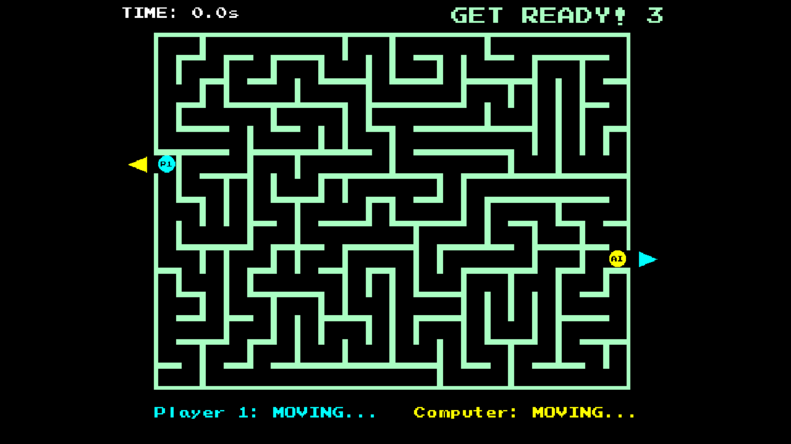

# Amazing Maze Remake (VB.NET and Python Implementations)



## Description
This project is a modern remake of the classic Amazing Maze game (originally published by Midway in 1976), implemented in two distinct programming languages - VB.NET and Python - for cross-platform enjoyment. The game features a procedurally generated 2D maze where players race to be the first to reach the exit.

## Technologies Used
- **VB.NET**: Built with `vbPixelGameEngine` for graphics rendering through Windows and Linux
- **Python**: Developed with `pygame` framework for cross-platform compatibility

## Features
- Random maze layouts produced by the original maze generation algorithm
- Single-player and two-player game modes
- 3-second warm-up stage to examine the maze before movement begins
- Pause functionality during gameplay
- AI opponent in single-player mode
- Intuitive keyboard controls for both players

## Gameplay
- **Controls**:
  - Player 1: Arrow keys (↑ ↓ ← →)
  - Player 2: WASD keys
  - Pause: "P" key
  - Exit: "ESC" key
- **Objective**: Navigate through the maze and reach the exit before your opponent
- **Warm-up Stage**: After selecting a game mode, you'll have 3 seconds to study the maze layout before movement becomes available
- **Win Condition**: Be the first player to reach the exit marker

## Installation
```bash
git clone https://github.com/Pac-Dessert1436/Amazing-Maze-Remake-VBPGE-Python.git
cd Amazing-Maze-Remake-VBPGE-Python
```

### VB.NET Version
1. Open the project in Visual Studio or VS Code
2. Restore NuGet packages:
   ```bash
   dotnet restore
   ```
3. Build and run the project:
   - **Visual Studio**: Press `F5` or click the "Start" button
   - **VS Code**: Execute these commands:
   ```bash
   dotnet build
   dotnet run
   ```

### Python Version
1. Install the required dependency:
   ```bash
   pip install pygame
   ```
2. Run the game:
   ```bash
   python amazing_maze.py
   ```

## Project Structure
The repository contains both implementations of the game:
- `Program.vb`: VB.NET implementation using vbPixelGameEngine
- `amazing_maze.py`: Python implementation using pygame
- `vbPixelGameEngine.dll`: Required library for VB.NET version

## License
This project is licensed under the MIT License. See the [LICENSE](LICENSE) file for full details.